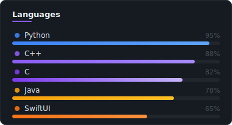
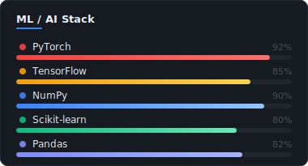

  

 

&nbsp;
&nbsp;
&nbsp;

 

---

### About

I'm **Neo** (like in *The Matrix*) — a CS major at Georgia Tech working at the intersection of deep learning and neuroscience. For the past three years I've been deploying ML/DL to classify EEG brain signals for mental health diagnosis, with results published in IEEE conferences. Alongside research, I design problems for the national Olympiad in Informatics, which keeps my algorithmic thinking sharp and translates directly to debugging complex systems.

I'm open to **AI research positions** and **AI/Software Engineering roles** in the US.

---

### Research & Publications

> **Depression Diagnosis via EEG Signal Classification**
> *IEEE Conference · 2024*
>
> Developed a deep learning pipeline (PyTorch + TensorFlow) to classify EEG brain signals for depression diagnosis. Achieved state-of-the-art accuracy, recall rate, and AUC across three years of iterative research on mental health biomarkers.
>
> [View Paper →](https://scholar.google.com/citations?view_op=view_citation&hl=en&user=miPGurwAAAAJ&citation_for_view=miPGurwAAAAJ:d1gkVwhDpl0C) &nbsp;·&nbsp; [Google Scholar →](https://scholar.google.com/citations?user=miPGurwAAAAJ&hl=en)

---

### Skills

<table>
<tr>
<td valign="top" width="50%">

</td>
<td valign="top" width="50%">

</td>
</tr>
</table>

---

### GitHub Stats

  
  

---

### Competitive Programming

I actively design problems for the **national Olympiad in Informatics**, spanning graph theory, dynamic programming, and combinatorics. Writing precise problem specifications and stress-testing edge cases is, it turns out, excellent training for production engineering — the habits transfer directly.

---

### Blog

*Writing about ML research, competitive programming, and the overlap between the two.*

 

| Title | Tags | Status |
|---|---|:---:|
| [**Depression Diagnosis from Brain Waves — What the EEG Data Taught Us**](https://scholar.google.com/citations?view_op=view_citation&hl=en&user=miPGurwAAAAJ&citation_for_view=miPGurwAAAAJ:d1gkVwhDpl0C) | `Deep Learning` `Neuroscience` `IEEE` | Published |
| **Designing Hard Problems: A Look Inside OI Problem-Setting** | `Algorithms` `Graph Theory` `Competitive Programming` | Coming Soon |
| **From PyTorch to Production: Lessons from 3 Years of EEG Research** | `PyTorch` `MLOps` `Research` | Coming Soon |

---

### Connect

Open to collaborations, research discussions, and job opportunities in the US.

**yonglineo@gmail.com** &nbsp;·&nbsp; [LinkedIn](https://www.linkedin.com/in/yong-li-neo-23360b2b8/) &nbsp;·&nbsp; [Google Scholar](https://scholar.google.com/citations?user=miPGurwAAAAJ&hl=en)
