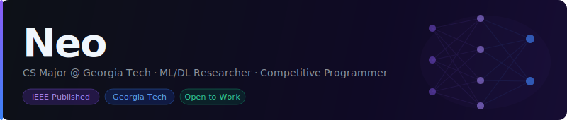

  

## Introduction
Hi there! 👋 My name is Neo (like in 'The Matrix')

I'm an experienced coder comfortable with languages like C, C++, Java, and Python, and I work with TensorFlow, PyTorch, NumPy, Git, SwiftUI, SciKit-learn.

I'm currently a CS major studying @Georgia Tech and is excited to implement ML/DL frameworks into the industry to create real-world impact. Over the past three years, I've been actively deploying ML/DL theories to classify EEG brain signals for mental health diagnosis; for my most recent project, I've worked on depression diagnosis, and the [results are published in IEEE](https://scholar.google.com/citations?view_op=view_citation&hl=en&user=miPGurwAAAAJ&citation_for_view=miPGurwAAAAJ:d1gkVwhDpl0C). These researches on mental health are performed using PyTorch and TensorFlow and the results (accuracy, recall rate, AUC) are all published in IEEE conferences.

At the same time, I'm a competitive programmer who actively designs challenges for the national Olympiad in Informatics. My problems range from multiple topics, including Graph Theories and Dynamic Programming. By learning algorithmic-solving, I'm able to nagivate difficult tasks in the workspace and resolve bugs in the code. 

I'm open to AI research positions as well as AI/software engineering jobs in the US. Feel free to reach out at yonglineo@gmail.com! Link to my [Google Scholar Page](https://scholar.google.com/citations?user=miPGurwAAAAJ&hl=en) and my [LinkedIn](https://www.linkedin.com/in/yong-li-neo-23360b2b8/).

<!--
**YLNeooo/YLNeooo** is a ✨ _special_ ✨ repository because its `README.md` (this file) appears on your GitHub profile.

Here are some ideas to get you started:

- 🔭 I'm currently working on ...
- 🌱 I'm currently learning ...
- 👯 I'm looking to collaborate on ...
- 🤔 I'm looking for help with ...
- 💬 Ask me about ...
- 📫 How to reach me: ...
- 😄 Pronouns: ...
- ⚡ Fun fact: ...
-->
